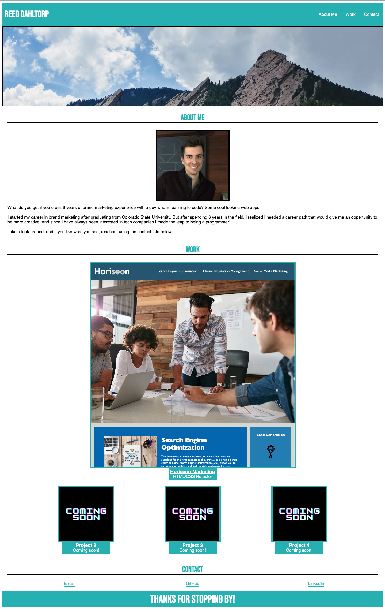

# Bootcamp Challenge 2: Portfolio

## Description

This repo contains the code used to develop my basic portfolio site utilizing HTML and CSS. The overall goal of this site is to provide a location to give potential employers and partners a place to get more information on me, view my past works, and provide some ways to get in contact with me.
 
As I developed this site I gained more knowledge around:
- Flexbox and to manipulate the flex items to easily center on and navigate the page.
- How media queries can be used to develop a responsive site.

## Installation

To install and work on the code, clone down the index.html, README.md, and assets folder (containing the images folder and CSS file) to your machine and open in a source code editor.

## Usage

The purpose of this web app is to display finished projects in a readable way as well as provide some additional info on the author including how to get in contact with them. 

When active, the code will look like the following image: 

For a live example click here: https://rdahltorp.github.io/bootcamp-challenge-2-Portfolio/

## Credits

I would like to say thank you to and acknowledge the Sunday-Study-Group slack channel from the DU coding bootcamp course as well as a couple BCS Learning Assistants, Alex and Chrystal, for helping me problem solve some issues I was facing with regards to flexbox.

